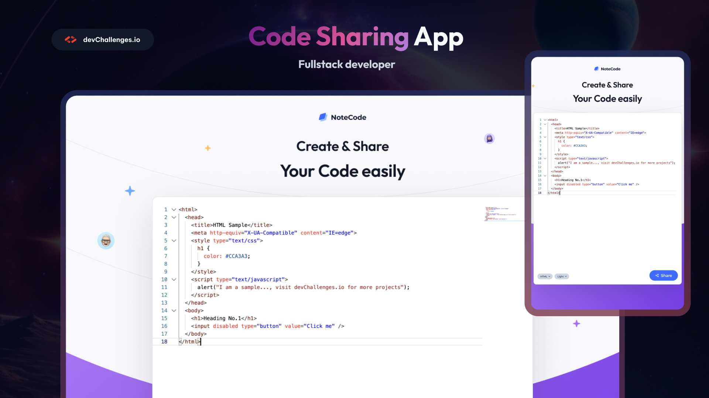

# NoteCode

 <!-- Add your project screenshot or header image here -->

## Live Site

[Live Site URL](https://neon-malabi-e46535.netlify.app) <!-- Add your live site URL here -->

## Technologies Used

- **React**: A JavaScript library for building user interfaces.
- **TypeScript**: A typed superset of JavaScript that compiles to plain JavaScript.
- **Vite**: A fast build tool and development server for modern web projects.
- **Firebase**: A platform developed by Google for creating mobile and web applications.
  - **Authentication**: Used for anonymous user authentication.
  - **Realtime Database**: Used for storing and retrieving code snippets.
- **React Router**: A collection of navigational components that compose declaratively with your application.
- **CodeMirror**: A versatile text editor implemented in JavaScript for the browser.
- **React Toastify**: A library for notifications in React applications.
- **React Loader Spinner**: A library for loading spinners in React applications.

## Features

- Create and share code snippets easily.
- Choose from various programming languages.
- Switch between light and dark themes.
- Copy shareable links to clipboard.
- Save and retrieve code snippets from Firebase.

## Setup and Installation

### Prerequisites

- Node.js (v14 or higher)
- npm (v6 or higher)

### Installation

1. **Clone the repository:**

    ```sh
    git clone https://github.com/svetstoykov/NoteCode.git
    cd NoteCode
    ```

2. **Install dependencies:**

    ```sh
    npm install
    ```

3. **Set up Firebase:**

    - Create a Firebase project at [Firebase Console](https://console.firebase.google.com/).
    - Enable Firebase Authentication (Anonymous).
    - Create a Realtime Database.
    - Obtain your Firebase configuration and add it to a `.env` file in the root of your project:

    ```env
    VITE_FIREBASE_API_KEY=your_api_key
    VITE_FIREBASE_AUTH_DOMAIN=your_auth_domain
    VITE_FIREBASE_DATABASE_URL=your_database_url
    VITE_FIREBASE_PROJECT_ID=your_project_id
    VITE_FIREBASE_STORAGE_BUCKET=your_storage_bucket
    VITE_FIREBASE_MESSAGING_SENDER_ID=your_messaging_sender_id
    VITE_FIREBASE_APP_ID=your_app_id
    ```

4. **Run the development server:**

    ```sh
    npm run dev
    ```

5. **Build for production:**

    ```sh
    npm run build
    ```

6. **Preview the production build:**

    ```sh
    npm run serve
    ```

## Folder Structure

- `src/components`: Contains React components like `Header`, `Footer`, and `MainPage`.
- `src/services`: Contains service files like `firebase.ts` for Firebase operations.
- `src/assets`: Contains static assets like images and logos.
- `src/common`: Contains common constants and models.

## License

This project is licensed under the MIT License. See the [LICENSE](LICENSE) file for details.
